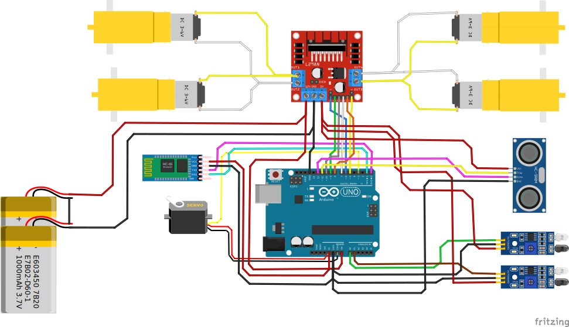

# 🛠️ Build Instructions: 3-in-1 Multi-Mode Robot Car

Welcome to the detailed build guide! Below you will find all the required hardware components, a detailed wiring diagram, and step-by-step instructions on how to assemble and program your robot.

## 🛒 Hardware Requirements

To build the robot, you will need the following components:
- **1x Arduino Uno, Nano, or compatible microcontroller**
- **1x L298N Motor Driver**
- **2x or 4x DC Motors with Wheels**
- **1x HC-SR04 Ultrasonic Sensor**
- **1x Servo Motor** (e.g., SG90)
- **2x IR Sensors** (for obstacle detection / edge drop detection)
- **1x HC-05 or HC-06 Bluetooth Module**
- **1x Robot Chassis**, battery pack (e.g., 2x 18650 cells), and jumper wires

---

## 🔌 Wiring Diagram

Follow the diagram below to connect all your components correctly.

  

### Hardware Pin Connections Reference:
| Component         | Arduino Pin | Other Connections               |
|-------------------|-------------|---------------------------------|
| **L298N ENA**     | D6          |                                 |
| **L298N IN1**     | D9          |                                 |
| **L298N IN2**     | D10         |                                 |
| **L298N ENB**     | D5          |                                 |
| **L298N IN3**     | D7          |                                 |
| **L298N IN4**     | D8          |                                 |
| **Ultrasonic Trig**| D11        | VCC -> 5V, GND -> GND           |
| **Ultrasonic Echo**| D12        |                                 |
| **Right IR**      | A0          | VCC -> 5V, GND -> GND           |
| **Left IR**       | A1          | VCC -> 5V, GND -> GND           |
| **Servo**         | D3          | VCC -> 5V, GND -> GND           |
| **HC-05 TX**      | RX (D0)      | VCC -> 5V, GND -> GND           |
| **HC-05 RX**      | TX (D1)      | (Use voltage divider if needed) |

> ⚠️ **IMPORTANT WARNING:** Always disconnect the `TX` and `RX` wires of the Bluetooth module from the Arduino before uploading code via USB. Failure to do so will result in an upload error!

---

## 💻 Software Setup

### 1. Uploading the Arduino Code
1. Open the file located at `ArduinoCode/ArduinoCode.ino` using the [Arduino IDE](https://www.arduino.cc/en/software).
2. Ensure you have the required libraries installed in the IDE:
   - `NewPing` (for the ultrasonic sensor)
   - `Servo` (built-in usually, but verify it's available)
3. Connect your Arduino to your computer via USB.
4. Select the correct **Board** and **Port** under the `Tools` menu.
5. Click **Upload**. Wait for the "Done Uploading" message.

### 2. Setting Up the Android App
There are two ways to get the app:

**Option A: Pre-compiled download (Recommended)**
1. Go to the [**GitHub Releases page**](../../releases).
2. Download the latest `.apk` file to your Android phone and install it (you may need to allow "Install from unknown sources" in settings).

**Option B: Build it yourself**
1. Install [Android Studio](https://developer.android.com/studio).
2. Open the `AndroidApp` directory as a project.
3. Build and run the app directly onto your connected Android device.

**Option C: Build it via GitHub Actions (Automated CI/CD)**
Since this repository includes a GitHub Action workflow, the APK is built automatically!
1. Go to the **Actions** tab on your GitHub repository page.
2. Click on the most recent successful workflow run (named *"Build Android App"*).
3. Scroll to the bottom to the **Artifacts** section.
4. Download the `RobotCarController-APK` zip file, extract it, and install the `.apk` on your phone.

---

## ⚡ Electrical Noise Issue & Hardware Fix

**Problem:**
During testing, DC motor electrical noise caused Arduino instability, Bluetooth disconnections, and occasional unexpected resets.

**Cause:**
Brushed DC motors generate voltage spikes and high-frequency noise due to internal commutator sparks. These spikes travel back through the L298N motor driver and disturb the microcontroller power rails and signals.

**Hardware Solution Implemented:**
- Used **0.1µF (104) ceramic capacitors** for noise suppression.
- Installed 4 capacitors directly across the motor terminals (one per motor).
- Motors are wired in 2 parallel pairs due to the L298N having 2 channels.
- Added 2 additional 0.1µF ceramic capacitors across the L298N motor output terminals for additional spike suppression.
- **Total capacitors used:** 6x 0.1µF ceramic capacitors.

**Result:**
- Significant reduction in EMI.
- Stable Arduino behavior.
- Stable Bluetooth communication.
- No unexpected resets.

### Recommendation for Builders

If you experience:
- Random Arduino resets
- Bluetooth disconnection
- Servo jitter
- Unstable behavior when motors start

**Fix:** Install 0.1µF ceramic capacitors across the motor terminals and near the driver outputs as described above.

---

## 🎮 How to Play

1. **Power up the robot** using the battery pack.
2. **Enable Bluetooth** on your Android smartphone.
3. Go to your phone's Bluetooth settings and **pair with the HC-05/HC-06 module**. 
   *Note: The default pairing PIN is usually `1234` or `0000`.*
4. **Open the Controller App**.
5. Connect to the paired Bluetooth device from within the app.
6. Use the on-screen buttons to switch between **Manual, Obstacle Avoidance, and Human Following mode**, and drive around!
